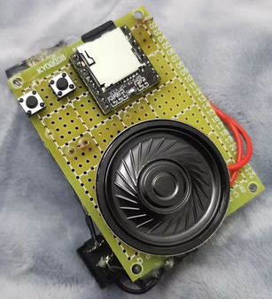

# 一切的源头

我的朋友想自己DIY一个MP3，他找到了DFPlayer Mini这么一个小玩意

然后他就制作出了这么个东西

我看到了以后觉得挺好玩，于是就有了这个项目

# 组装说明

元件位号与电阻阻值

先将沿着中间的缝锯开，锯开后使用砂纸打磨边缘至两条丝印消失即可。（pcb建议厚度选择1.2mm或以下的方便锯开）

DFPlayer Mini的排针太长会刺到电池，需要修剪，用笔标记一下再剪更整齐。

TP4056模块焊接前可以先把这两根铜柱拧好，TP4056模块就不那么容易焊歪。

# 材料购买

[3.7v锂电池【选“802035(500mah)”】](https://item.taobao.com/item.htm?spm=a1z09.2.0.0.499a2e8dqCXePG&id=13835387208&_u=810ehpfb1e60&skuId=5307836674129)

[1810椭圆形喇叭【选“1810-8Ω1W-L60MM/喇叭”】](https://item.taobao.com/item.htm?spm=a1z09.2.0.0.499a2e8dqCXePG&id=684959311533&_u=810ehpfbafc0&skuId=5066974667613)

[TP4056模块](https://item.taobao.com/item.htm?spm=a1z09.2.0.0.499a2e8dqCXePG&id=606192736346&_u=810ehpfb7fc6)

[Mini MP3模块](https://item.taobao.com/item.htm?spm=a1z09.2.0.0.499a2e8dqCXePG&id=531658144081&_u=810ehpfbbb65)

[M3圆头螺丝【M3x3~M3x6之间都可以】](https://detail.tmall.com/item.htm?id=40084590132&spm=a1z09.2.0.0.499a2e8dqCXePG&_u=810ehpfbb198)

[M3双通六角铜柱【选M3x12】](https://detail.tmall.com/item.htm?id=588307625790&spm=a1z09.2.0.0.499a2e8dqCXePG&_u=810ehpfb8c40&skuId=4181820599994)

!!!链接仅供参考!!!

# 演示视频

[【开源】一个简易MP3的展示视频](https://www.bilibili.com/video/BV132HSe3EBA/)
